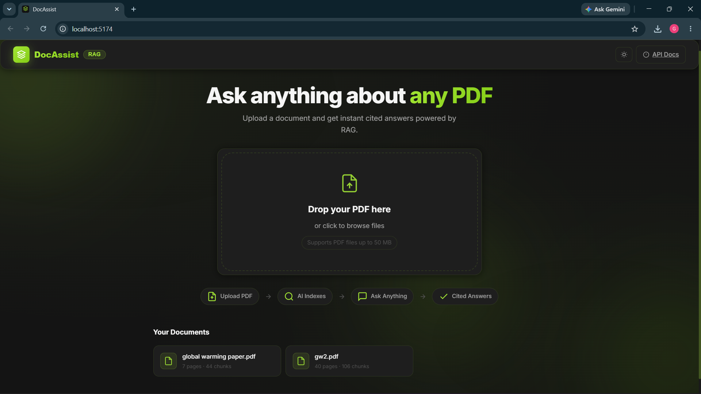
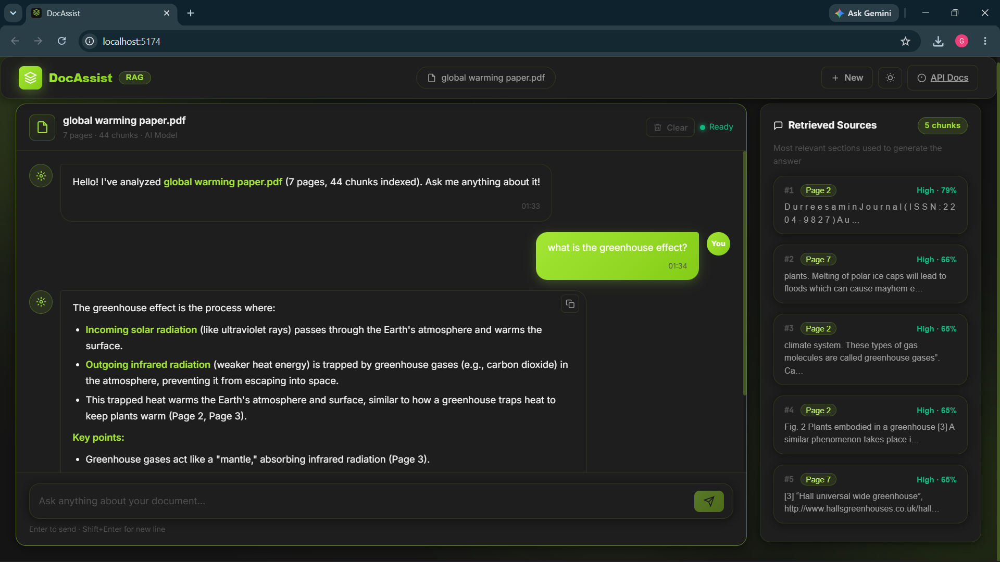

# DocAssist — RAG-Based PDF Q&A

> Upload any PDF and get instant AI-powered answers grounded in your document — with source citations and page references.

[](https://fastapi.tiangolo.com)
[](https://langchain.com)
[](https://trychroma.com)
[](https://react.dev)
[](https://mistral.ai)
[](https://docker.com)

---

## Screenshots





---

## Features

- **PDF Upload** — Drag-and-drop or click to upload. Validates file type and size (max 50 MB) before processing.
- **Semantic Chunking** — LangChain `RecursiveCharacterTextSplitter` with 100-character overlap to preserve sentence boundaries.
- **Local Embeddings** — `all-MiniLM-L6-v2` via sentence-transformers. No embedding API cost, works fully offline.
- **Vector Search** — ChromaDB with cosine similarity. Each PDF gets its own isolated collection.
- **Grounded Answers** — Mistral AI LLM answers strictly from retrieved context. No hallucinations.
- **Source Citations** — Every answer links back to the exact page and chunk used, with a relevance score.
- **Multi-document** — Upload and switch between multiple PDFs. Delete any document with its vectors.
- **Dark / Light mode** — Persisted via `localStorage`.

---

## Architecture

```
PDF Upload
  └─► PyMuPDF extraction
        └─► Semantic chunking (LangChain)
              └─► Embed + store (ChromaDB · all-MiniLM-L6-v2)

User Question
  └─► Embed query (same model)
        └─► Cosine similarity search → Top-5 chunks
              └─► Mistral AI (grounded prompt)
                    └─► Answer + source citations
```

---

## Tech Stack

| Layer | Technology |
|---|---|
| Backend API | Python 3.11 · FastAPI · Uvicorn |
| PDF Parsing | PyMuPDF (fitz) |
| Chunking | LangChain RecursiveCharacterTextSplitter |
| Embeddings | sentence-transformers `all-MiniLM-L6-v2` (local) |
| Vector Store | ChromaDB (persistent, cosine similarity) |
| LLM | Mistral AI (`mistral-small-latest`) |
| Frontend | React 18 · Vite · Vanilla CSS |
| Reverse Proxy | nginx (Docker) |
| Container | Docker · docker-compose |

---

## Quick Start

### Option A — Docker (recommended)

```bash
git clone https://github.com/gurnr1095/docassist.git
cd docassist
cp .env.example .env
# Add your MISTRAL_API_KEY to .env
docker compose up --build
```

Open **http://localhost** — the full app is running.

### Option B — Local development

**Prerequisites:** Python 3.11+, Node.js 18+, a [Mistral AI](https://console.mistral.ai) API key.

```bash
git clone https://github.com/gurnr1095/docassist.git
cd docassist
cp .env.example .env
# Add your MISTRAL_API_KEY to .env
```

**Backend:**
```bash
cd backend
python -m venv .venv
.venv\Scripts\activate        # Windows
# source .venv/bin/activate   # macOS/Linux
pip install -r requirements.txt
cd ..
uvicorn backend.main:app --reload --port 8000
```

**Frontend** (new terminal):
```bash
cd frontend
npm install
npm run dev
# App at http://localhost:5173
```

---

## Configuration

Copy `.env.example` to `.env` and fill in:

| Variable | Default | Description |
|---|---|---|
| `MISTRAL_API_KEY` | — | **Required.** Your Mistral AI key |
| `MISTRAL_BASE_URL` | `https://api.mistral.ai/v1` | API base URL |
| `LLM_MODEL` | `mistral-small-latest` | Mistral model ID |
| `MAX_CHUNK_SIZE` | `800` | Characters per chunk |
| `CHUNK_OVERLAP` | `100` | Overlap between chunks |
| `TOP_K_RESULTS` | `5` | Chunks retrieved per query |
| `MAX_UPLOAD_BYTES` | `52428800` | Max file size (50 MB) |
| `CHROMA_PERSIST_DIR` | `./chroma_db` | Vector store path |
| `UPLOAD_DIR` | `./uploads` | Temp upload path |
| `LOG_LEVEL` | `INFO` | Logging level |

---

## API Reference

| Method | Endpoint | Description |
|---|---|---|
| `GET` | `/health` | Health check — ChromaDB + API key status |
| `POST` | `/api/upload` | Upload and process a PDF |
| `GET` | `/api/documents` | List all uploaded documents |
| `DELETE` | `/api/documents/{doc_id}` | Delete document and its vectors |
| `POST` | `/api/query` | Ask a question (full RAG pipeline) |

Interactive Swagger docs at **http://localhost:8000/docs** (local) or **http://localhost/docs** (Docker).

---

## Project Structure

```
docassist/
├── backend/
│   ├── Dockerfile
│   ├── requirements.txt
│   ├── main.py                  # FastAPI app, middleware, lifespan
│   ├── config.py                # Pydantic BaseSettings from .env
│   ├── routers/
│   │   ├── upload.py            # Upload, list, delete endpoints
│   │   └── query.py             # RAG query endpoint
│   ├── services/
│   │   ├── pdf_service.py       # PyMuPDF + chunking
│   │   ├── vector_service.py    # ChromaDB operations
│   │   └── llm_service.py       # Mistral via LangChain
│   └── models/
│       └── schemas.py           # Pydantic request/response schemas
├── frontend/
│   ├── Dockerfile               # Multi-stage: Vite build → nginx
│   ├── nginx.conf               # Reverse proxy + SPA routing
│   ├── index.html
│   ├── vite.config.js
│   └── src/
│       ├── App.jsx
│       ├── index.css            # Charcoal + Lime design system
│       ├── services/api.js      # Axios client
│       └── components/
│           ├── UploadSection.jsx
│           ├── ChatInterface.jsx
│           ├── MessageBubble.jsx
│           ├── SourceCard.jsx
│           └── ErrorBoundary.jsx
├── docker-compose.yml
├── .env.example
└── README.md
```

---

## Design Notes

- **Local embeddings** — `all-MiniLM-L6-v2` is pre-downloaded at Docker build time so there's no cold-start delay on first query.
- **Strict RAG prompt** — the LLM is instructed to answer only from retrieved chunks, with a fallback message if context is insufficient.
- **Per-document collections** — each PDF gets its own ChromaDB collection, enabling clean targeted deletion without affecting other documents.
- **Thread-safe registry** — a `threading.Lock` guards all reads and writes to the document registry JSON.
- **Relevance scoring** — cosine distance is converted to similarity (`1 - distance`) and shown as High / Medium / Low with the raw percentage.

---

*Built with FastAPI · LangChain · ChromaDB · Mistral AI · React*
